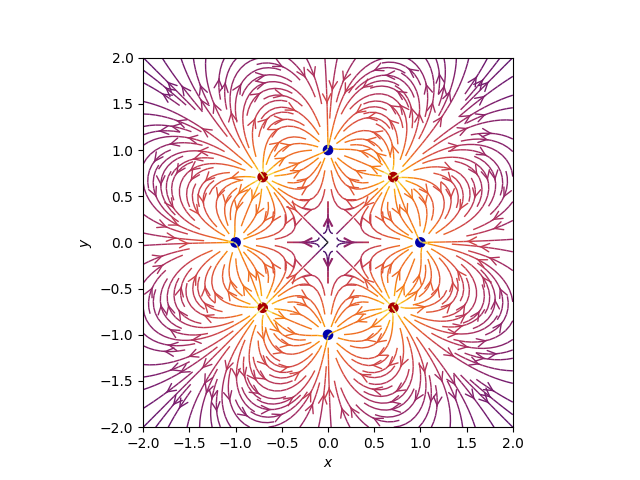
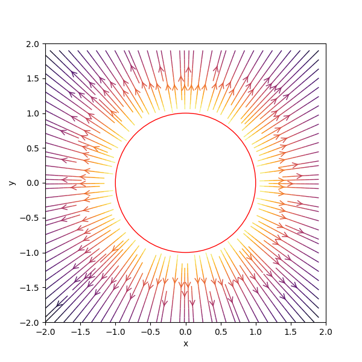
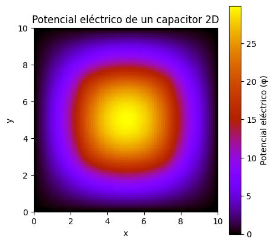
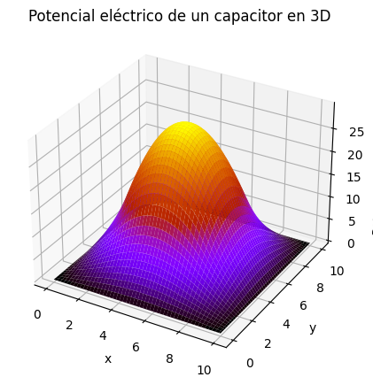
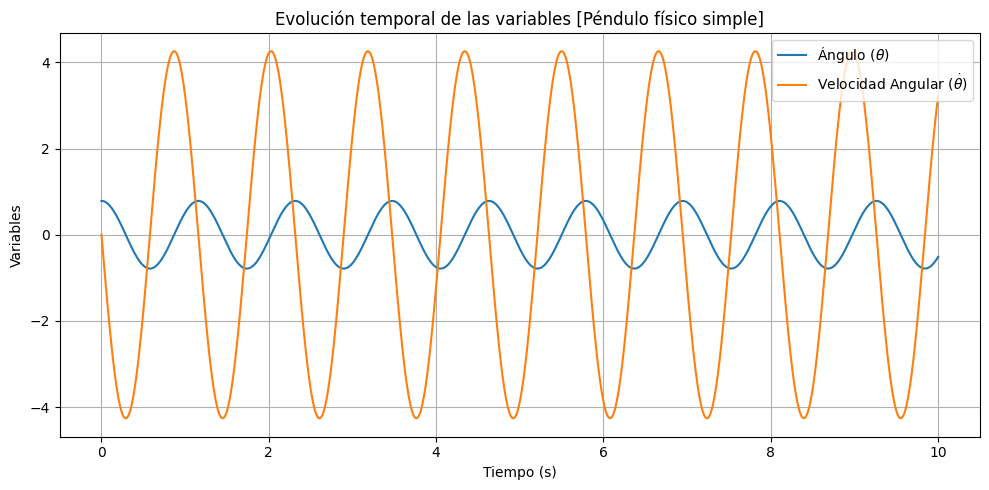
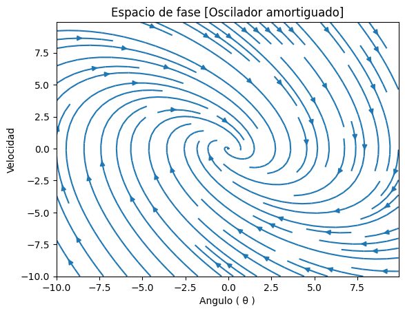
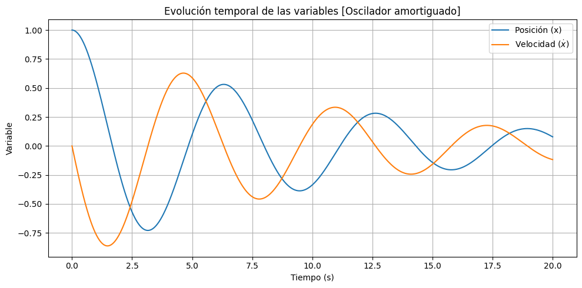

# Computational-Physics

## Resumen

En este repositorio se presentan ejemplos de problemas en diferentes áreas de la Física. La idea es utilizar métodos numéricos y hacer correcciones basadas en la física para obtener gráficas que simulen el comportamiento de los sistemas

## Electrodynamics

### Distribución de cargas de un dipolo

### Distribución de cargas de un anillo

### Potencial eléctrico 2D de capacitor

### Potencial eléctrico 3D de capacitor

## Oscillations

### Pendulo físico

Espacio fase

Evolucion temporal de las variables físicas

### Pendulo amortiguado

Espacio fase

Evolucion temporal de las variables físicas

