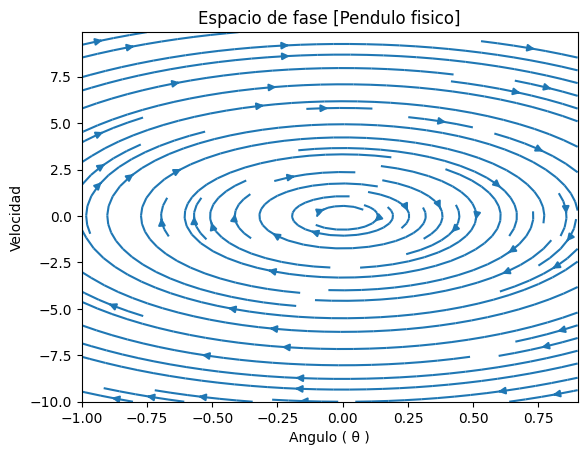

# Computational-Physics

## Resumen

En este protocolo de tesis se habla sobre la necesidad de tener una herramienta
computacional que ayude a reducir la brecha entre entusiastas de la cosmología y el
conocimiento técnico que demanda el área, reduciendo tiempo de aprendizaje para
que el estudiante pueda seguir adelante, analizado otros temas en lugar de estancarse
en problemas técnicos que no aportan a su formación.

## Electrodynamics

### Distribución de cargas de un dipolo

### Distribución de cargas de un anillo

### Potencial eléctrico 2D de capacitor

### Potencial eléctrico 3D de capacitor

## Oscillations

### Pendulo físico

Espacio fase

Evolucion temporal de las variables físicas

### Pendulo amortiguado

Espacio fase

Evolucion temporal de las variables físicas

